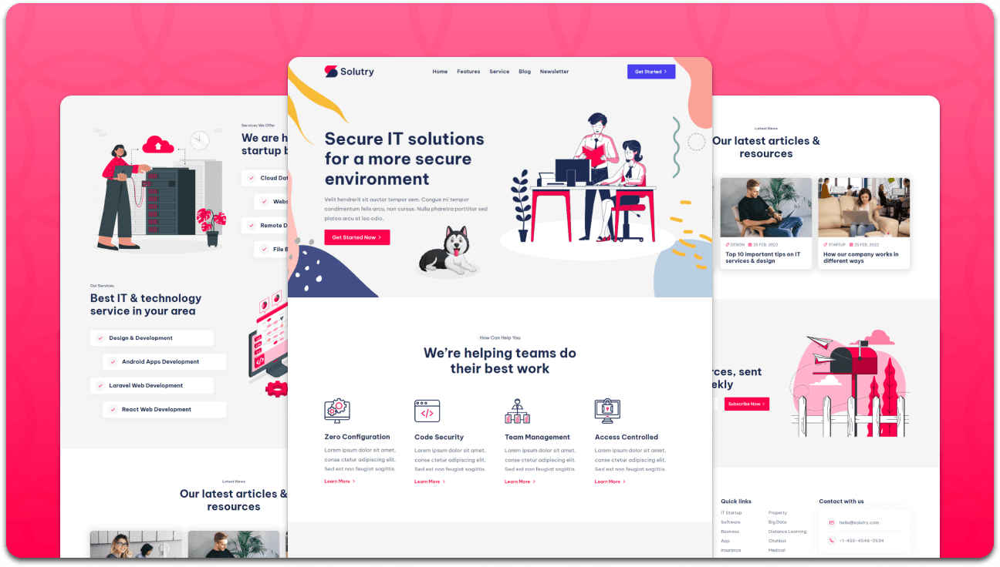

<div align="center">
  


  <br />
  <br />
  
  

  <h2 align="center">Solutry - IT agency website</h2>

  Solutry is fully responsive IT agency website, <br />Responsive for all devices, built using HTML, CSS, and JavaScript.

  <a href="https://elmanci2.github.io/Solutry/"><strong>➥ Live Demo</strong></a>

</div>

<br />

### Demo Screeshots



### Prerequisites

Before you begin, ensure you have met the following requirements:

* [Git](https://git-scm.com/downloads "Download Git") must be installed on your operating system.

### Run Locally

To run **Solutry** locally, run this command on your git bash:

Linux and macOS:

```bash
sudo git clone https://github.com/elmanci2/Solutry.git
```

Windows:

```bash
git clone https://github.com/elmanci2/Solutry.git
```


### License

This project is **free to use** and does not contains any license.
